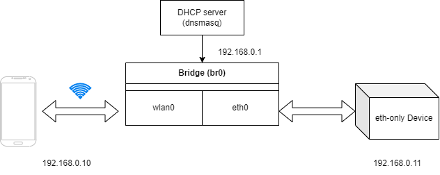

# Set up Standalone Network Bridging WLAN and Ethernet

I ran into this peculiar situation in which I needed to set up a local network, with or without Internet access, on which an Ethernet-only device can communicate with my smartphone. I had no access to a spare wireless router, which would have made this situation a non-issue.



While searching the Internet for the perfect (and ideally simple) solution to my problem, I found a myriad of articles and posts on how to turn Pi into a wireless AP which extends an existing network, which do not address the problem I have. After much digging and experimentation, I finally landed on a very easy solution, which I document here.

The solution was tested on Raspberry Pi 3B running Raspberry Pi OS 64-bit (May 3rd 2023 Release). To make Pi issue IP address via DHCP, install **_dnsmasq_**. Also make sure predictable network interface name feature is disabled in **_raspi-config_**. Otherwise, Pi might change the interface name to something like concatenation of the MAC address with the interface type as the prefix.

## Switch to root account

```shell
sudo -Es    # makes your life easier for what we are going to do next
```

## Create the bridge and add wlan0 and eth0 to it

Modify /etc/network/interfaces and add the following lines
I chose 192.168.0.1/24 as the IP address range. You can change it to your liking.

```shell
auto br0
iface br0 inet static
    bridge_ports eth0 wlan0
    address 192.168.0.1 # the address of the bridge interface
    netmask 255.255.255.0
    network 192.168.50.0
    gateway 192.168.50.1

```

## Create a new wpa_supplicant service

```shell
systemctl edit wpa_supplicant@wlan0.service
```

In the opened editor, add the following lines

```shell
[Unit]
# make sure wpa_supplicant service waits for the bridge
Requires=sys-subsystem-net-devices-br0.device
After=sys-subsystem-net-devices-br0.device

[Service]
ExecStartPre=/sbin/iw dev %i set type __ap
ExecStartPre=/bin/ip link set %i master br0

ExecStart=
ExecStart=/sbin/wpa_supplicant -c /etc/wpa_supplicant/wpa_supplicant-%I.conf -Dnl80211,wext -i%I -bbr0

ExecStopPost=-bin/ip link set %i nomaster
ExecStopPost=-/sbin/iw dev %i set type managed
```

## Config wlan0 as AP

Create a new file as /etc/wpa_supplicant/wpa_supplicant-wlan0.conf with the content below

```shell
ctrl_interface=DIR=/var/run/wpa_supplicant GROUP=netdev
update_config=1  # allow wpa_supplicant to store configuration changes (such as password) persistently
country=US  # the country you are in

network={
    ssid="YOUR_SSID"
    mode=2
    key_mgmt=WPA-PSK # or set to NONE if you want an open AP
    psk="YOUR_PASSWORD"
}

```

Set the permission of this file to 600 to allow access by the root only

```shell
systemctl disable wpa_supplicant.service # disable station service
systemctl enable wpa_supplicant@wlan0.service
```

## Disable dhcpcd

There is no need to change dhcpcd.conf as some solutions suggests. Just use systemctl to disable dhcpcd service.

```shell
systemctl disable dhcpcd.service
```

## Configure and Enable dnsmasq

Make a copy of /etc/dnsmasq.conf first and then edit it as follows. Change the dhcp-range per your own use case.

```shell
interface=br0
    dhcp-range=192.168.0.2,192.168.0.100,255.255.255.0,24h
    dhcp-option=option:router,192.168.0.1
    dhcp-option=option:dns-server,8.8.8.8,1.1.1.1
```

Enable/Restart dnsmasq using systemctl
systemctl restart dnsmasq.service
systemctl enable dnsmasq.service

Reboot and voila.

## Bonus Tips for Debugging

- Use **_systemctl list-dependencies <service>_** to check the dependency chain of a particular service.
- Use **_iw dev wlan0 info_** to examine the wlan0 interface in detail
- dnsmasq leases can be found at /var/lib/misc/dnsmasq.leases
- follow the real-time update of a systemd service like tail -f log using **_journalctl -f -u <service_name>.service_**
